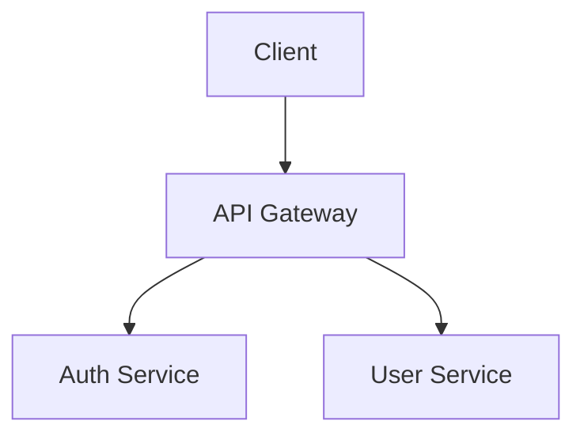

# 팁과 트릭

Oh-My-OpenCode의 숨겨진 기능과 생산성을 높이는 팁들을 소개합니다.

## ⌨️ 단축키 & 빠른 명령어

### 모드 전환

| 입력 | 동작 |
|------|------|
| `ulw` + 요청 | Ultrawork 모드로 즉시 실행 |
| `Tab` | Prometheus 모드 진입 |
| `analyze` + 요청 | 분석 모드 (수정 없이 분석만) |

### 유용한 슬래시 명령어

```bash
/init-deep          # 프로젝트 전체 AGENTS.md 생성
/refactor           # LSP 기반 안전한 리팩토링
/start-work         # Prometheus 계획 실행
/stop-continuation  # 진행 중인 작업 중지
```

---

## 🎯 숨겨진 기능들

### 1. 병렬 에이전트 실행

여러 탐색을 동시에 요청하면 병렬로 실행됩니다:

```bash
"다음을 동시에 찾아줘:
1. 인증 관련 미들웨어
2. API 라우트 목록
3. 데이터베이스 스키마"
```

→ 3개의 Explore 에이전트가 동시에 실행!

### 2. 세션 이어하기

이전 세션의 컨텍스트를 이어서 사용:

```bash
"아까 작업하던 인증 시스템 이어서 해줘"
```

→ 세션 매니저가 자동으로 이전 컨텍스트 복구

### 3. 백그라운드 작업

긴 작업을 백그라운드에서 실행:

```bash
"백그라운드에서 전체 테스트 실행하고 결과 알려줘"
```

→ 다른 작업하면서 결과 대기 가능

### 4. 조건부 실행

```bash
"테스트가 통과하면 커밋하고, 실패하면 원인 분석해줘"
```

→ 결과에 따라 다른 동작 수행

---

## 💬 효과적인 프롬프트 패턴

### 패턴 1: 역할 지정

```bash
"시니어 백엔드 개발자 관점에서 이 API 설계를 리뷰해줘"
```

### 패턴 2: 출력 형식 지정

```bash
"변경사항을 다음 형식으로 정리해줘:
- 파일명: 변경 내용
- 파일명: 변경 내용"
```

### 패턴 3: 제약 조건 명시

```bash
"기존 API 호환성을 유지하면서 성능을 개선해줘"
```

### 패턴 4: 단계별 요청

```bash
"1단계: 현재 구조 분석
2단계: 개선안 제시
3단계: 내가 승인하면 구현"
```

---

## 🔧 설정 트릭

### 에이전트별 모델 커스터마이징

```jsonc
// .opencode/oh-my-opencode.json
{
  "agents": {
    // Oracle을 더 저렴한 모델로
    "oracle": {
      "model": "anthropic/claude-3-5-sonnet",
      "temperature": 0.1
    },
    // Explore를 더 빠른 모델로
    "explore": {
      "model": "anthropic/claude-3-haiku",
      "temperature": 0
    }
  }
}
```

### 자주 쓰는 스킬 기본 로드

```jsonc
{
  "default_skills": ["git-master", "frontend-ui-ux"]
}
```

### 특정 훅 비활성화

```jsonc
{
  "disabled_hooks": ["comment-checker"]  // AI 주석 체크 비활성화
}
```

---

## 🚀 생산성 부스터

### 1. 템플릿 활용

자주 쓰는 요청을 템플릿으로:

```bash
# API 엔드포인트 생성 템플릿
"다음 스펙으로 API 만들어줘:
- 경로: /api/v1/{리소스}
- 메서드: GET, POST, PUT, DELETE
- 인증: 필요
- 응답 형식: { success, data, error }"
```

### 2. 체크리스트 요청

```bash
"PR 전 체크리스트 확인해줘:
- [ ] 타입 에러 없음
- [ ] 테스트 통과
- [ ] 린트 통과
- [ ] 불필요한 console.log 제거"
```

### 3. 비교 분석 요청

```bash
"현재 구현과 이상적인 구현을 비교해서 보여줘:

| 항목 | 현재 | 개선안 |
|------|------|--------|"
```

---

## 🎨 출력 커스터마이징

### 코드 블록 언어 지정

```bash
"TypeScript로 작성하고 코드 블록에 언어 표시해줘"
```

### 다이어그램 요청

```bash
"이 아키텍처를 Mermaid 다이어그램으로 그려줘"
```

결과:


### 표 형식 요청

```bash
"API 엔드포인트를 표로 정리해줘:
| 메서드 | 경로 | 설명 | 인증 |"
```

---

## 🔍 디버깅 팁

### 1. 단계별 실행 요청

```bash
"한 단계씩 실행하고 각 단계 결과를 보여줘"
```

### 2. 드라이런 모드

```bash
"실제로 변경하지 말고 어떤 변경이 필요한지만 보여줘"
```

### 3. 롤백 준비

```bash
"변경 전에 현재 상태를 git stash 해줘"
```

### 4. 상세 로그 요청

```bash
"각 단계에서 실행한 명령어와 결과를 상세히 보여줘"
```

---

## 📁 파일 작업 팁

### 여러 파일 동시 수정

```bash
"다음 파일들을 일괄 수정해줘:
- src/api/*.ts: 에러 핸들링 추가
- src/types/*.ts: 새 타입 추가"
```

### 패턴 기반 검색

```bash
"TODO 주석이 있는 모든 파일 찾아줘"
"console.log가 있는 프로덕션 코드 찾아줘"
```

### 파일 생성 템플릿

```bash
"새 API 라우트 파일 만들어줘. 우리 프로젝트의 다른 라우트 파일 패턴 따라서"
```

---

## 🤝 협업 팁

### PR 설명 자동 생성

```bash
"이 변경사항으로 PR 설명 작성해줘:
- 제목
- 변경 사항
- 테스트 방법
- 스크린샷 필요 여부"
```

### 코드 리뷰 요청

```bash
"이 PR을 리뷰해줘. 특히:
- 보안 이슈
- 성능 문제
- 코딩 컨벤션"
```

### 커밋 메시지 생성

```bash
"Conventional Commits 형식으로 커밋 메시지 만들어줘"
```

---

## ⚡ 성능 최적화 팁

### 1. 작은 단위로 요청

```bash
# 나쁜 예
"전체 앱 리팩토링해줘"

# 좋은 예
"UserService 클래스만 리팩토링해줘"
```

### 2. 필요한 컨텍스트만 제공

```bash
# 나쁜 예
"이 프로젝트 전체를 분석하고..."

# 좋은 예
"src/auth/ 폴더의 인증 로직을 분석하고..."
```

### 3. 캐시 활용

같은 세션에서 이미 탐색한 내용은 다시 요청하지 않기:

```bash
"아까 찾은 인증 미들웨어에 로깅 추가해줘"
# (다시 찾지 않고 이전 결과 활용)
```

---

## 📚 다음 단계

- [문제 해결](/guide/troubleshooting) - 자주 발생하는 문제와 해결법
- [베스트 프랙티스](/guide/best-practices) - 효과적인 사용 패턴
